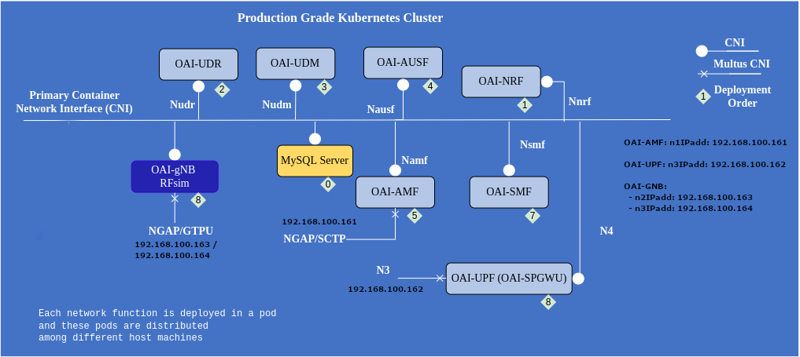
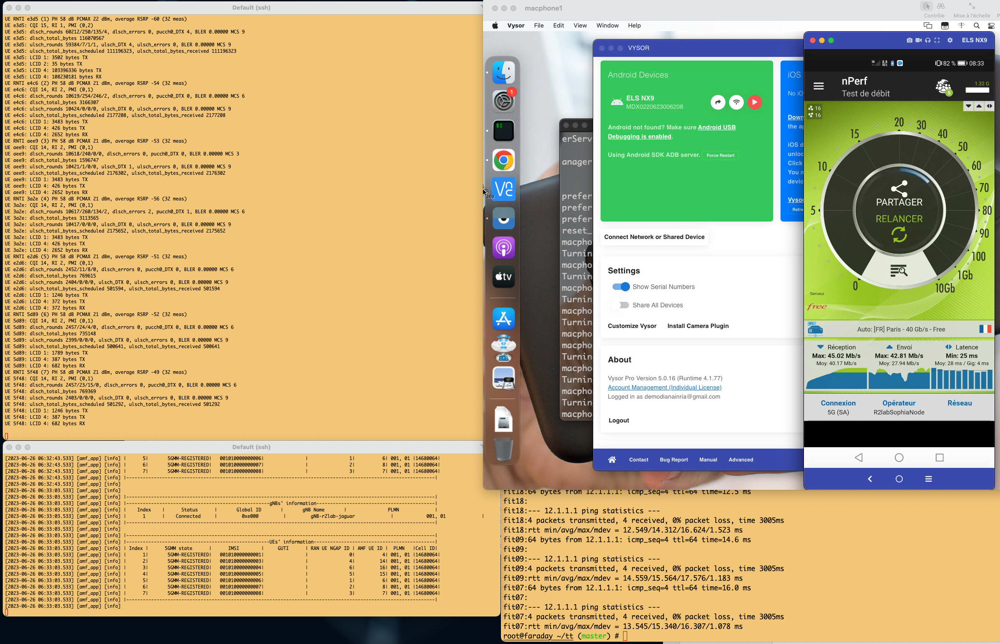

# OAI5G demo on SophiaNode

The *[demo-oai.py](./demo-oai.py)* script aims to demonstrate how to automate a OAI5G deployment on kubernetes (k8s) worker nodes on the SophiaNodefit01cluster and on R2lab nodes attached as workers in the cluster. One the R2lab k8s worker node will be used to deploy all the pods. 

The RAN part is located in the R2lab testbed and may involve:

* for gNB: [USRP B210](https://www.ettus.com/all-products/ub210-kit/) connected to k8s worker R2lab nodes, AW2S RRU (such as [Jaguar MIMO 2x2 or Panther MIMO 4x4](https://www.aw2s.com/fr/solutions/rrh-rru/)) or USRP (such as [N300](https://www.ettus.com/all-products/USRP-N300/) or [N320](https://www.ettus.com/all-products/USRP-N320/)) connected with fibers to the *oai-gnb* pod running on a k8s worker server on the cluster;
* for UE: [Quectel RM 500Q-GL](https://www.quectel.com/wp-content/uploads/2021/03/Quectel_RM500Q-GL_5G_Specification_V1.3.pdf) nodes attached to regular R2lab nodes in R2lab.


**Acknowledgments:** _Support regarding configuration of the OAI5G functions has been provided by
Sagar Arora at Eurecom <sagar.arora@eurecom.fr>._

### Software dependencies

Before you can run the script in this directory, you need to install its dependencies

    pip install -r requirements.txt

### Basic usage

All the forms of the **demo-oai.py** [nepi-ng](https://nepi-ng.inria.fr/) script assume there is a deployed kubernetes cluster, and that the provided slicename holds the current lease on R2lab.

The mental model is that we are dealing with essentially three states:

* (0) initially, the k8s cluster is running and some R2lab nodes have joined the cluster as workers;
* (1) after setup, OAI5G charts have been configured and are ready to be started, UEs selected are also configured and ready to be used;
* (2) at that point one can use the `--start` option to start the system, which amounts to deploying pods on the k8s cluster;
* (back to 1) it is point one can roll back and come back to the previous state, using the `--stop` option

with none of the `--start/--stop/--cleanup` option the script goes from state 0 to (2), unless the `-a` option is given.

Run `demo-oai.py --help` for more details.

### References

* [Extend a SophiaNode Kubernetes cluster with R2lab worker nodes](https://github.com/sopnode/r2lab-k8s)
* [OAI 5G Core Network Deployment using Helm Charts](https://gitlab.eurecom.fr/oai/cn5g/oai-cn5g-fed/-/blob/master/docs/DEPLOY_SA5G_HC.md)
* [R2lab welcome page](https://r2lab.inria.fr/)
* [R2lab run page (requires login)](https://r2lab.inria.fr/run.md)
* [github repo for this page](https://github.com/sopnode/oai5g-rru)


## The different steps...

### Prerequisites:

The required number of R2lab worker nodes for the target experimentation scenario are up and have joined the k8s cluster. 

This can be done using the **join-cluster.py** nepi-ng script available in the [Extend a SophiaNode Kubernetes cluster with R2lab worker nodes](https://github.com/sopnode/r2lab-join-cluster) repo.

The **demo-oai.py** script will then use one of the R2lab worker nodes to orchestrate the deployment of OAI 5G pods on the cluster. The default R2lab node used for that in the script is *fit01* and you can use another one through the `-k` option.

Note that if the target OAI5G scenario includes a gNB with USRP N3XX or AW2S RRU device, the oai-gnb pod will not run on a r2lab worker node but on a more powerful worker node in the k8s cluster.


### Configuration

If a USRP B210 gNB or Quectel UE devices are necessary in the target scenario, the **demo-oai.py** script will have to either switch on the target B210 device or install a specific R2lab image for 5G Quectel devices on some R2lab nodes beforehand.

After that, the script will deploy OAI5G pods on the k8s cluster through the R2lab worker node, which is *fit01* by default. 

First, it will copy on the worker node *fit01* the *demo-oai.sh* bash script and will configure all the parameters (e.g., Core Network parameters, k8s namespace, nodes to run amf/spgwu/gnb functions, rru parameters, etc.) within this script using the **configure-demo-oai.sh** script.

```
root@fit01# /root/configure-demo-oai.sh update
```

Then, the script will clone the r2lab-rrus branch of [oai-cn5g-fed](https://gitlab.eurecom.fr/oai/cn5g/oai-cn5g-fed.git) gitlab repository on the R2lab node *fit01*. To do it manually, you will have to run:

```
root@fit01# git clone -b r2lab-rrus https://gitlab.eurecom.fr/oai/cn5g/oai-cn5g-fed
```
Then it will apply different patches to configure the different OAI5G pods to be run on R2lab/SophiaNode platform with the desired configuration. To do it manually, you will have to run on *fit01* :

```
root@fit01# ./demo-oai.sh configure-all
```

These patches include the configuration of [multus CNI](https://github.com/k8snetworkplumbingwg/multus-cni) interfaces specific to the SophiaNode platform. See an example of IP addresses configuration in the following figure modified from the [OAI 5G Core Network Deployment using Helm Charts](https://gitlab.eurecom.fr/oai/cn5g/oai-cn5g-fed/-/blob/master/docs/DEPLOY_SA5G_HC.md) tutorial.



### Deployment

Finally, the **demo-oai.py** script will deploy the OAI5G pods on the k8s cluster. However, if you prefer to do it manually, you will have to do the following steps on *fit01*:


##### Wait until all fit nodes are in READY state
`root@fit01# kubectl wait node --for=condition=Ready fit01` 

##### Run the OAI 5G Core Network pods
``` bash
root@fit01# cd /home/oai/oai-cn5g-fed/charts/oai-5g-core/oai-5g-basic`

root@fit01# helm --namespace=oai5g spray .
```
##### Wait until all 5G Core pods are READY
`root@fit01# kubectl wait pod -noai5g --for=condition=Ready --all`

##### Run the oai-gnb pod 
``` bash
root@fit01# cd /home/oai/oai-cn5g-fed/charts/oai-5g-ran
root@fit01# helm --namespace=oai5g install oai-gnb oai-gnb/
```
##### Wait until the gNB pod is READY
`root@fit01# kubectl wait pod -noai5g --for=condition=Ready --all`


### Customization

The **demo-oai.py** nepi-ng script has various options to change default parameters, run ``./demo-oai.py --help`` on your laptop to see all of them.

The main options are:

  * `-k id` id of the R2lab node used to control OAI5G pods deployment; it is *fit01* by default.
  * `-R type` type of RRU device or *rfsim* in case of simulated ran.
  * `-Q id` R2lab node id used as 5G Quectel UEs; none by default.
  * `-q id` qhat node id used as 5G UE; none by default.
  * `-P id` phone id used as 5G UE; none by default.
  * `-L` to generate and retrieve OAI5G pods logs.
  * `-p` to generate and retrieve OAI5G pods logs with pcap.
  * `-a` to not launch the OAI5G pods by default.
  * `-s slicename` to provide the slicename that you used to book the platform, which by default is `inria_sopnode`.

For instance, if your slicename is `inria_sc` and you have not yet loaded the images on the R2lab nodes, to run a scenario with a AW2S jaguar RRU and a single UE (qhat02) without logs generated, you should run the following command on your laptop:

```bash
$ ./demo-oai.py -s inria_sc -l -R jaguar -q1
```

The oai-gnb pod can be configured with either a USRP B210, a USRP N300, a USRP N320, a AW2S Jaguar, a AW2S Panther or you can choose to use instead the OAI5G RF simulator. 

Note that the gnb configuration file name is set within the **demo-oai.sh** script and all the gnb configuration files are located in the **oai5g-rru/ran-config/conf/** directory on the R2lab node used used to control OAI5G pods deployment. Also, gNB k8s charts are located in the **oai5g-rru/ran-config/charts/** directory.

The two following options should be used only when the demo-oai.py script has already run at least once, i.e., when R2lab nodes have joined the k8s cluster and OAI5G setup is configured:

* `--stop` to remove all OAI5G pods. 
* `--start` to launch again all OAI5G pods as configured before.

The two above steps can also be done directly on *fit01* worker node:

```
root@fit01# /root/demo-oai.sh stop
root@fit01# /root/demo-oai.sh start
```

Note that the *demo-oai.sh* script allows to start/stop specific part of OAI5G pods using the options *start-cn, start-gnb, start-ue, stop-cn, stop-gnb* and *stop-ue*.

### Testing

At the end of the demo, few logs of the oai-gnb pod should be visible on the terminal.


To check logs of the different pods, you need first to log on one of the k8s workers or master nodes, e.g., *fit01*.

For instance, to check the logs of the `oai-gnb` pod, run:

``` bash

root@fit01# GNB_POD_NAME=$(kubectl -noai5g get pods -l app.kubernetes.io/name=oai-gnb -o jsonpath="{.items[0].metadata.name}")

root@fit01# kubectl -noai5g logs $GNB_POD_NAME -c gnb
```

In case of RF simulation (RRU=rfsim), it is possible to run a ping test directly on *fit01*:

```
root@fit01# ./demo-oai.sh run-ping
ping --I oaitun_ue1 c4 google.fr
PING google.fr (172.217.22.131) from 12.1.1.81 oaitun_ue1: 56(84) bytes of data.
64 bytes from par21s12-in-f3.1e100.net (172.217.22.131): icmp_seq=1 ttl=112 time=37.3 ms
64 bytes from par21s12-in-f3.1e100.net (172.217.22.131): icmp_seq=2 ttl=112 time=33.1 ms
64 bytes from par21s12-in-f3.1e100.net (172.217.22.131): icmp_seq=3 ttl=112 time=25.5 ms
64 bytes from par21s12-in-f3.1e100.net (172.217.22.131): icmp_seq=4 ttl=112 time=35.3 ms

--- google.fr ping statistics ---
4 packets transmitted, 4 received, 0% packet loss, time 3004ms
rtt min/avg/max/mdev = 25.581/32.838/37.361/4.453 ms
```

Now, assume that you want to restart the demo with some changes in the CN chart configuration, and test it on another namespace, say *oai5g_v2*, the sequence of steps will be:


* Stop the previous test ``` ./demo-oai.py --stop```
* Make your changes on *fit01* in configuration file */root/demo-oai.sh*. (If the CN parameters you want to change are not in script */root/demo-oai.sh*, you can directly change chart file */root/oai-cn5g-fed/charts/oai-5g-core/oai-5g-basic/values.yaml*.) Then run on your laptop:
* ``` ./demo-oai.py --namespace oai5g_v2 ```

The latter command will take into account your changes to reconfigure the charts, and will then launch the OAI5G pods on the *oai5g_v2* namespace. 

Note that we don't use "--start" option in this case as this option skips the reconfiguration step. 


### Cleanup

To clean up the demo, you should first remove all OAI5G pods.

For that, you can run on your laptop ``./demo-oai.py --stop`` or run the following command on the k8s cluster:

```bash
root@fit01# helm -n oai5g ls --short --all | xargs -L1 helm -n oai5g delete
```

Another possibility is to run on *fit01*:

```
root@fit01# ./demo-oai.sh stop
```

Then, to shutdown R2lab worker nodes and remove them from the k8s cluster, run on your laptop the following command:

``` bash
$ ./demo-oai.py --cleanup

```


### Scenario with an external Core Network

Using the option --gnb-only, it is possible to run only the OAI5G RAN part, i.e., oai-gnb pod and UEs. 

For instance, the following command will prepare a scenario from scratch to launch the USRP N300-based gNB with 2 Quectel-based UEs:

```
$ ./demo-oai.py -R n300 -Q7 -Q9 --gnb-only -a -l
```

Once the script terminates, you need to log on a k8s worker node and configure the following parameters in the script demo-oai.sh to match the external CN parameters:

```
    # Set the external AMF IP address
    AMF_IP_ADDR="172.22.10.6" # external AMF IP address, e.g., "172.22.10.6"
    # Set the local host network interface to reach AMF/UPF
    IF_NAME_GNB_N2="ran" # Host network interface to reach AMF/UPF
    # Set the local IP address of the latter network interface
    IP_GNB_N2N3="10.0.20.243" # local IP to reach AMF/UPF, e.g., "10.0.20.243"
    # Set the route to reach AMF/UPF
    ROUTES_GNB_N2="[{'dst': '172.22.10.0/24','gw': '10.0.20.1'}]"
```

Let's assume that the oai-gnb pod can reach the external Core Network through a VPN client running on the server that hosts the oai-gnb pod, the VPN client will provide an IP address in 10.0.20.0/24. Let's also assume that the IP address of the AMF is *172.22.10.6*. 
The following setup should be added on the latter server.

```
ip link add ran type veth peer name ran-int
ip link set up ran
ip link set up ran-int
ip addr add 10.0.20.1/24 dev ran-int

```

 
At the Core Network side, you should configure the following parameters:

 * MCC="001"
 * MNC="01"
 * DNN="oai.ipv4"
 * SST="1"
 * TAC="1"
 * FULL_KEY="fec86ba6eb707ed08905757b1bb44b8f"
 * OPC="C42449363BBAD02B66D16BC975D77CC1"

As precised in https://r2lab.inria.fr/hardware.md, the two Quectel UEs on fit07 and fit09 have IMSI: <001010000000003> and <001010000000004> respectively. So, to authenticate UEs in the CN, the mysql database should be configured with:

```
INSERT INTO `AuthenticationSubscription` (`ueid`, `authenticationMethod`, `encPermanentKey`, `protectionParameterId`, `sequenceNumber`, `authenticationManagementField`, `algorithmId`, `encOpcKey`, `encTopcKey`, `vectorGenerationInHss`, `n5gcAuthMethod`, `rgAuthenticationInd`, `supi`) VALUES
('001010000000003', '5G_AKA', 'fec86ba6eb707ed08905757b1bb44b8f', 'fec86ba6eb707ed08905757b1bb44b8f', '{\"sqn\": \"000000000020\", \"sqnScheme\": \"NON_TIME_BASED\", \"\lastIndexes\": {\"ausf\": 0}}', '8000', 'milenage', 'C42449363BBAD02B66D16BC975D77CC1', NULL, NULL, NULL, NULL, '001010000000003');

INSERT INTO `AuthenticationSubscription` (`ueid`, `authenticationMethod`, `encPermanentKey`, `protectionParameterId`, `sequenceNumber`, `authenticationManagementField`, `algorithmId`, `encOpcKey`, `encTopcKey`, `vectorGenerationInHss`, `n5gcAuthMethod`, `rgAuthenticationInd`, `supi`) VALUES
('001010000000004', '5G_AKA', 'fec86ba6eb707ed08905757b1bb44b8f', 'fec86ba6eb707ed08905757b1bb44b8f', '{\"sqn\": \"000000000020\", \"sqnScheme\": \"NON_TIME_BASED\", \"\lastIndexes\": {\"ausf\": 0}}', '8000', 'milenage', 'C42449363BBAD02B66D16BC975D77CC1', NULL, NULL, NULL, NULL, '001010000000004');

INSERT INTO `SessionManagementSubscriptionData` (`ueid`, `servingPlmnid`, `singleNssai`, `dnnConfigurations`) VALUES
('001010000000003', '00101', '{\"sst\": 1, \"sd\": \"16777215\"}', '{\"oai.ipv4\":{\"pduSessionTypes\": { \"defaultSessionType\": \"IPV4\"},\"sscModes\": {\"defaultSscMode\": \"SSC_MODE_1\"},\"5gQosProfile\": {\"5qi\": 1,\"arp\":{\"priorityLevel\": 15, \"preemptCap\": \"NOT_PREEMPT\",\"preemptVuln\":\"PREEMPTABLE\"},\"priorityLevel\":1}, \"sessionAmbr\":{\"uplink\":\"1000Mbps\", \"\downlink\":\"1000Mbps\"}}}');

INSERT INTO `SessionManagementSubscriptionData` (`ueid`, `servingPlmnid`, `singleNssai`, `dnnConfigurations`) VALUES
('001010000000004', '00101', '{\"sst\": 1, \"sd\": \"16777215\"}', '{\"oai.ipv4\":{\"pduSessionTypes\": { \"defaultSessionType\": \"IPV4\"},\"sscModes\": {\"defaultSscMode\": \"SSC_MODE_1\"},\"5gQosProfile\": {\"5qi\": 1,\"arp\":{\"priorityLevel\": 15, \"preemptCap\": \"NOT_PREEMPT\",\"preemptVuln\":\"PREEMPTABLE\"}, \"priorityLevel\":1}, \"sessionAmbr\":{\"uplink\": \"1000Mbps\", \"\downlink\": \"1000Mbps\"}}}');

```

Before running the oai-gnb pod, you can check that you have the following route *172.22.10.0/24* set to reach the AMF.

Then, log on the k8s worker node and start the oai-gnb pod:

```
root@fit01# ./demo-oai.sh start-gnb
```

### Snapshot of a running scenario with a jaguar-based gnb and 7 UEs including phone1 (Huawei P40)




